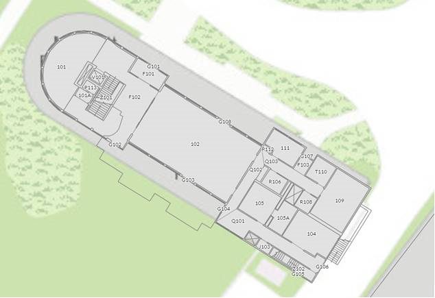

# Logistics {-}

## Meals {-}

Breakfast and coffee will be provided on Wednesday, Thursday, and Friday mornings.

Lunch will be provided on Wednesday and Thursday.
The Bootcamp will end by lunch time on Friday.

We will have vegetarian and vegan food options.

## Locations {-}

Most in-person events at Bootcamp 2023 will be held in the newly renovated **Marriott Foundation Building** on the Penn State University Park campus.
The Marriott Foundation Building is located just north of the Nittany Lion Inn, near the intersection of Park Avenue and Atherton Street.

### Marriott Foundation Building  {- #marriott-fdn-bldg}

```{r, out.width="100%", fig.cap="Marriott Foundation Building"}
knitr::include_graphics("https://psu-gatsby-files-prod.s3.amazonaws.com/s3fs-public/styles/4_3_2000w/public/Oak%20Building.jpeg?h=71976bb4&itok=AOCn0pbO")
```

```{r, out.width="100%", fig.cap="Marriott Foundation Building location from https://www.map.psu.edu"}
knitr::include_url("https://www.map.psu.edu/?id=1134#!ct/59509,33177,25403,26748,26749,26750,27255?m/336393?s/", height = "400px")
```

Plenary sessions will be held in 102 Marriott Foundation Building. 
Smaller breakout sessions will be held in 109 Marriott Foundation Building and in the second floor library.
Accessible restrooms are available on the first floor.
Participants not requiring access to the accessible restrooms are asked to use facilities in the basement.

```{r, out.width="100%", fig.cap="Marriott Foundation Building 1st Floor"}

```

Please enter the Marriott Foundation Building from the East side, adjacent to the Nittany Lion Inn parking lot.

### Keller Building {- #keller-bldg}

Some breakout sessions may be held in 115 Keller Building on [Thursday, August 10](#day_2) and [Friday, August 11](#day_3).

```{r, out.width="100%", fig.cap="Keller Building"}
knitr::include_graphics("https://la.psu.edu/wp-content/uploads/sites/2/2022/11/Keller-Building-April-2022-01.jpg")
```

```{r, out.width="100%", fig.cap="Keller Building location from https://www.map.psu.edu"}
knitr::include_url("https://map.psu.edu/?id=1134#!m/272192?s/", height = "400px")
```

### Parking {-}

Parking (at your own expense) is available at the Nittany Lion Parking Deck.
