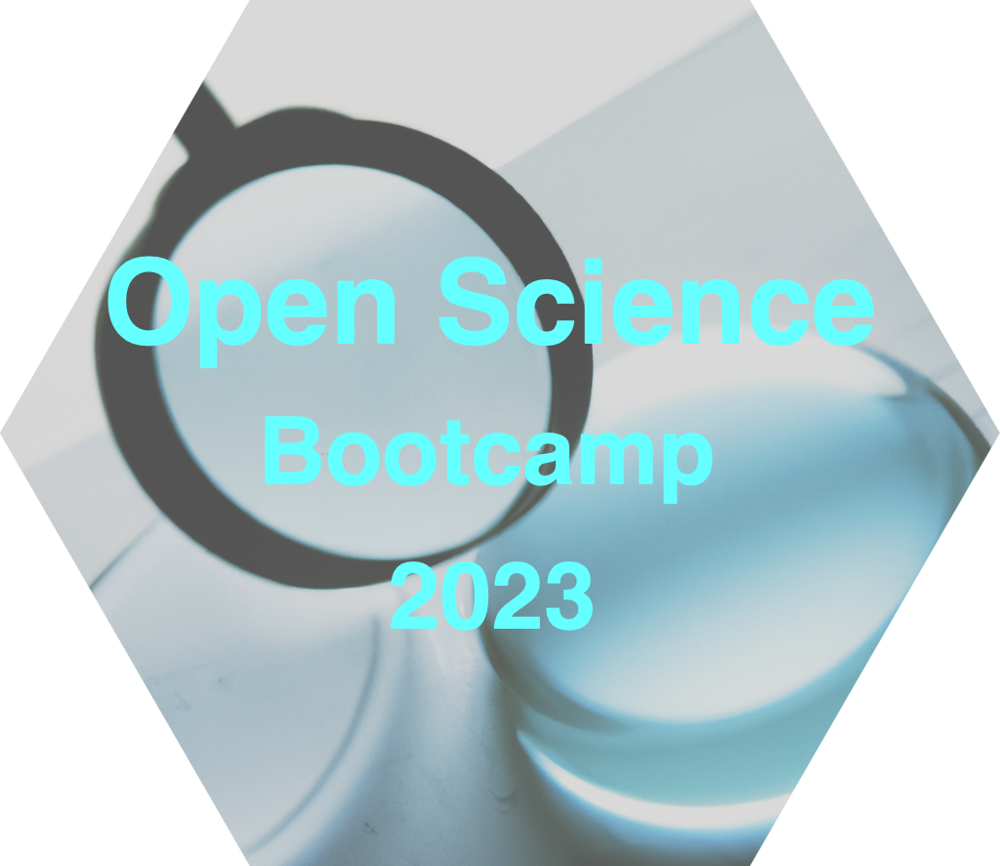

--- 
title: "Open Science Bootcamp 2023"
author: "The 2023 Bootcamp Program Planning Committee"
date: "`r Sys.Date()`"
site: bookdown::bookdown_site
documentclass: book
bibliography: [include/bib/book.bib, include/bib/packages.bib, include/bib/bootcamp.bib]
csl: include/bib/apa.csl
url: "https://penn-state-open-science.github.io/bootcamp-2023/"
description: |
  This is the home site for the Open Science Bootcamp @ PSU 2023.
link-citations: yes
github-repo: "penn-state-open-science/bootcamp-2023/"
---

```{r}
knitr::opts_chunk$set(echo = FALSE, warning = FALSE,
                      fig.align = "center",
                      fig.path = "include/img/")
library(tidyverse)
library(bslib)
library(htmltools)
```


<!-- ```{r, out.width="60%", fig.cap="Image generated by OpenAI with keywords 'open transparent reproducible science'"} -->
<!-- #  -->
<!-- ``` -->

# About {-}

```{r make-word-cloud, echo=FALSE, warning=FALSE}
open_sci_words <- c("openness", "transparency", "reproducibility", "replication", "sharing",
                        "robustness", "reach", "versioning", "data", "wrangling", "crisis", "rigor",
                        "R", "Python", "ethics", "repository", "statistics", "scripts", "automation", "git", "preregistration")
wts <- c(.7, .6, .5, .5, .7, .3, .2, .2, .8, .4, .3, .7, .2, .3, .5, .2, .6, .3, .2, .2, .4)/4

wordcloud::wordcloud(words = open_sci_words, freq = wts, random.color = TRUE, rot.per = .25, colors = c("red", "blue", "orange", "yellow", "brown", "black", "aquamarine", "chartreuse", "coral", "bisque", "cyan", "darkmagenta")) # http://www.stat.columbia.edu/~tzheng/files/Rcolor.pdf
```

This site documents and describes the 2023 Open Science Bootcamp to be held at the University Park campus of [the Pennsylvania State University](https://www.psu.edu) Wednesday, August 9 through Friday, August 11, 2023 at the [Marriott Foundation Building](#marriott-fdn-bldg) (and if needed [Keller Building](#keller-bldg)) on the Penn State University Park campus.

The Bootcamp is being planned by a hard-working [committee](program-planning-committee.html) of staff, graduate students, and faculty, many of whom also plan to present.

::: {.rmdwarning}

**TO REGISTER**: Visit <https://forms.gle/Q8fecFZXq6Yp2Cq69>.

:::

The Bootcamp would not be possible without the generosity and hard work of our [sponsors and supporters](#acknowledgements).

## Goals {-}

- To create a focal point for activity and learning related to open science practices.
- To accelerate the development of a community of scholars who are interested in open science.
- To plan next steps that will foster the emergence of a robust open science community at Penn State.


<!-- ### Remote participants {-} -->

<!-- Bootcamp 2023 will be streamed online at the following URL: -->

<!-- <https://psu.zoom.us/bootcamp-2023/> -->

<!-- All sessions will be recorded and made publicly available at a later date. -->

## Origins {-}

The Bootcamp is an outgrowth of discussions that emerged in early 2022 among some of the conference organizers and builds upon the lessons learned in an open science [survey](https://penn-state-open-science.github.io/survey-fall-2022/) that a number of Penn State researchers completed in late 2022 and early 2023.

It also builds upon the lessons learned in hosting bootcamps focused on the R programming language sponsored in [2017](https://psu-psychology.github.io/r-bootcamp/), [2018](https://psu-psychology.github.io/r-bootcamp-2018/), and [2019](https://psu-psychology.github.io/r-bootcamp-2019/) by [Psychology Department](https://psych.la.psu.edu) and [HDFS](https://hhd.psu.edu/hdfs) faculty.

## Acknowledgements {-}

We gratefully acknowledge the [Department of Psychology](http://psych.la.psu.edu), the [Child Study Center (CSC)](https://csc.la.psu.edu), the [Department of Statistics](https://science.psu.edu/stat), the [Center for Social Data Analytics](https://soda.la.psu.edu), the [Center for Language Acquisition](https://language.la.psu.edu), the [College of the Liberal Arts](https://la.psu.edu), the [Institute for Computational and Data Science (ICDS)](https://icds.psu.edu), the [Social Sciences Research Institute (SSRI)](https://ssri.psu.edu), [Laureen Teti](https://psych.la.psu.edu/directory/laureen-teti-ph-d), and [Nancy English](https://psych.la.psu.edu/directory/nec101) for support.

```{r add-bib-entries, include=FALSE}
# automatically create a bib database for R packages
knitr::write_bib(c(
  .packages(), 'bookdown', 'knitr', 'rmarkdown'
), 'include/bib/packages.bib')
```
